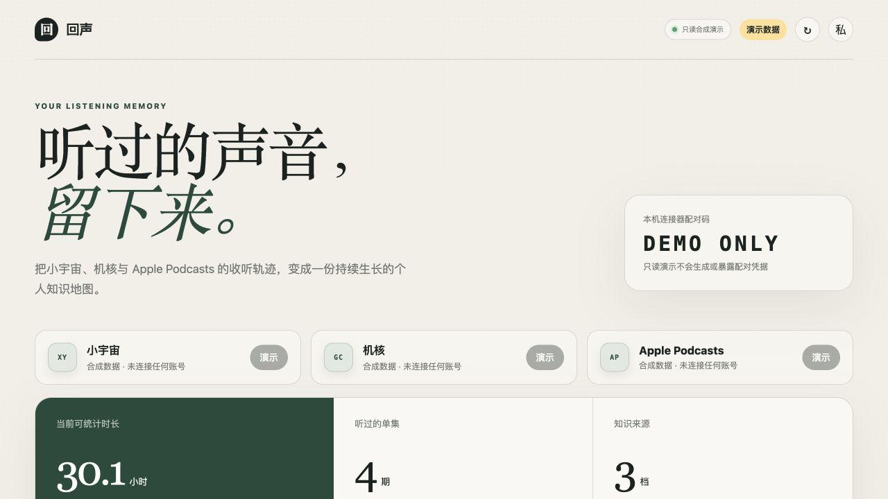
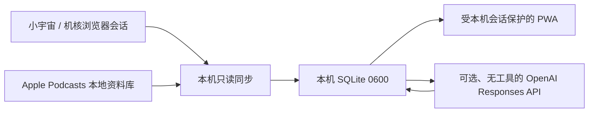

# 回声 · Podcast Memory

一个 local-first 的播客收听分析与知识回顾原型。它把小宇宙、机核和 Apple Podcasts 的个人收听记录整理到本机 SQLite，区分平台统计值与估算值，并提供可选的 AI 文字回顾。

[](https://github.com/eudaemoniaYH/echo-podcast-memory/actions/workflows/check.yml)
[](https://nodejs.org/)
[](LICENSE)



> [!WARNING]
> 这是个人研究原型，不是小宇宙、机核或 Apple 的官方产品。小宇宙与机核适配使用浏览器登录会话和没有公开稳定性承诺的接口，Apple 适配依赖私有本地数据库结构。只读不等于获得平台自动化授权；使用可能违反平台条款、导致接口失效或账号受限。请先自行取得许可或改用平台正式 API / 用户导出，不要把本项目作为生产服务、多人服务或公开托管服务。

本仓库公开可见并可被 Star，但不是开源软件；只允许下载、原样运行并用于个人非商业评估，未授予修改、再分发、公开托管或商业使用许可。见 [LICENSE](LICENSE)。

## 核心能力

- **Listening Analytics**：统一展示收听时长、节目数、单集数、最近收听和月度节奏，并明确区分准确值与估算值。
- **Knowledge Memory**：搜索单集和文字回顾；可选地将简介、show notes 或时间轴整理成分类、摘要、要点、提纲、关键词与回看问题。



## 当前实现

- 小宇宙：收听历史、播放进度、月度播放秒数和分页终身总里程。
- 机核：可见历史、节目正文、时间轴、单集元数据和最后进度；历史时长是估算值。
- Apple Podcasts：只读读取由 iPhone 同步到 Mac 的单集、进度、已播放状态、最近播放时间和 show notes。
- 本机 SQLite、10 分钟增量同步、启动同步、手动同步和 macOS LaunchAgent。
- Chrome/Chromium 本地连接器；配对码 10 分钟有效且成功消费后立即失效。
- 本机 API 在每个数据目录首次运行时生成 256-bit 私密访问令牌；令牌存放于 0600 文件，重装时会复用，浏览器用它换取 HttpOnly、SameSite=Strict Cookie。
- PWA 离线个人资料默认不保存；用户显式开启后只读取 24 小时内的最近统计与回顾，过期数据会在下次打开时清除，并提供立即清除按钮。
- AI 快速回顾、自动回顾、音频转写和受保护音频转写分别独立、默认关闭。
- 展示模式始终使用内存中的合成数据，即使环境变量意外指向真实数据库也不会读取它。

## 快速体验

需要 macOS 和 Node.js 22.13 或更新版本。只有显式启用整期音频转写时才需要另行安装 `ffmpeg`（例如 `brew install ffmpeg`）；普通统计、文字搜索和依据 show notes 的快速回顾不需要它。

```bash
git clone https://github.com/eudaemoniaYH/echo-podcast-memory.git
cd echo-podcast-memory
npm start
```

终端会显示一个形如 `http://127.0.0.1:8787/#access=...` 的本机私密地址。请从该地址进入；片段中的令牌不会发送给 HTTP 服务器，页面会在换取 HttpOnly Cookie 后立即从地址栏移除它。直接访问普通 loopback 地址时，个人 API 会返回 401。

只看界面和合成数据时使用：

```bash
PODCAST_MEMORY_SHOWCASE=1 npm start
```

展示模式只读、无配对码、无自动同步、无 AI，并强制使用内存数据库。它适合评审和截图，但仍不应部署到公共互联网。

日常使用可安装为 macOS 后台服务：

```bash
./scripts/install-macos-agent.sh
```

安装脚本会显示该数据目录对应的本机私密地址。重装不会自动轮换令牌；若怀疑地址泄露，停止服务、删除精确文件 `~/Library/Application Support/Podcast Memory/data/local-access-token` 后再安装。iPhone 私有访问见 [docs/iphone-setup.md](docs/iphone-setup.md)。

## 账号连接与撤销

Chrome 连接器需要 `cookies` API 和精确限定的小宇宙、机核 host 权限。Chrome 的 `cookies` 权限本身具备读写能力，但当前源代码只调用 `chrome.cookies.get`，读取以下会话值：

- 小宇宙：`x-jike-access-token`、`x-jike-refresh-token`，以及浏览器会话中的设备标识。
- 机核：`appToken`。

它不会获得平台密码，但这些 Cookie 本身是可代表账号访问的 bearer credentials。连接流程：

1. 在 `chrome://extensions` 开启开发者模式，加载本仓库的 `extension` 文件夹。
2. 在同一个 Chrome 正常登录小宇宙播客后台和机核网页。
3. 从经过本机会话验证的仪表盘复制 12 位配对码，在扩展中连接。
4. 令牌只发送到 `127.0.0.1:8787`，随后保存到 macOS Keychain。

撤销访问时，应在两个平台退出登录或撤销会话、停用/删除扩展，并删除对应 Keychain 项：

```bash
security delete-generic-password -a default -s com.podcast-memory.xiaoyuzhou
security delete-generic-password -a default -s com.podcast-memory.gcores
security delete-generic-password -a default -s com.podcast-memory.openai
```

Apple Podcasts 不读取账号 Cookie。它以独立、可超时的子进程和 SQLite read-only 模式读取 Mac 上由 Apple 自己同步的本地资料库；首次访问时 macOS 可能要求允许 `node` 访问其他 App 的数据。

## 数据口径

| 来源 | 展示口径 | 准确性边界 |
| --- | --- | --- |
| 小宇宙 | 分页 `mileage` 终身累计；`monthly-wrapped` 用于月度图表 | 平台统计值；终身与月度不会重复相加 |
| 机核 | 最近可见历史的播放进度 | 估算值；快进、回退、离线播放及平台历史范围都会造成偏差 |
| Apple Podcasts | 已完成单集时长加未完成单集当前进度 | 估算值；跨设备同步不是逐秒收听历史 API |

## 可选 AI：默认关闭并按量计费

AI 不使用 ChatGPT 订阅，也不启动 Codex/Shell。快速回顾直接调用无工具的 OpenAI Responses API，发送 `tools: []`、严格 JSON Schema 和 `store: false`。`store: false` 不等于零保留：OpenAI 官方说明默认仍可能保留最多 30 天的滥用监测日志；请根据你的 API 项目数据控制设置判断是否适合处理这些内容。见 [OpenAI API data controls](https://platform.openai.com/docs/models/default-usage-policies-by-endpoint)。

显式启用手动快速回顾：

```bash
ENABLE_AI_SUMMARY=1 ./scripts/install-macos-agent.sh
```

然后从安装脚本给出的私密地址打开回声，在“可选 AI”中保存 OpenAI API Key。Key 保存在 Keychain；请求会按 OpenAI Platform API 价格计费。每次回顾会发送：

- 播客名与单集名；
- 节目简介、show notes 或时间轴，清理 HTML 后最多 120,000 个字符；
- 请求发生的时间，因此服务商可能推断你正在整理该单集。

自动回顾还需第二个显式开关：

```bash
ENABLE_AI_SUMMARY=1 AUTO_SUMMARY_ENABLED=1 ./scripts/install-macos-agent.sh
```

首次启用只建立完成事件基线，不批量处理旧历史。自动任务串行执行；Apple 单纯手动“标为已播放”不会触发。

整期转写需另行设置 `ENABLE_API_TRANSCRIPTION=1`，并在每次点击时确认“整期音频将分段上传、可能产生费用”。机核受保护/会员音频还会被默认拒绝；即使额外设置 `ALLOW_PROTECTED_AUDIO_TRANSCRIPTION=1`，也只应处理你有明确权利上传的内容。

## 安全与隐私边界

- 服务只监听 `127.0.0.1`；Host 校验阻止 DNS rebinding，个人 API 另需本机私密会话或精确匹配的 Tailscale Serve 身份。
- Tailscale 方案只支持 Serve，不支持 Funnel；远程来源与登录身份必须精确匹配。
- SQLite、WAL、备份、访问令牌和本机访问令牌为 0600；数据目录为 0700。
- 单集详情 API 不返回原始 description、metadata、外部 ID、封面 URL 或可能携带 bearer token 的音频/feed URL。
- 小宇宙令牌请求拒绝 HTTP 重定向；音频下载只允许 HTTPS、受控 host、公开 IP 和逐跳验证。
- API Key 写入 Keychain 时通过 stdin 传递，不出现在进程 argv；平台令牌和 API Key service 名在 `com.podcast-memory.*` 下。
- 仓库忽略 `.data/`、SQLite、配对码、本机访问令牌、环境文件、日志、缓存和构建产物；公开截图只含合成数据。
- 可选 PWA 离线资料保存在使用它的那台 Mac/iPhone 浏览器，而不是只在运行服务的 Mac；默认关闭，只读取 24 小时内的缓存，并在下次打开时清除过期数据。

该设计不能保护你免受已经以同一 macOS 用户身份运行并拥有该用户文件/Keychain 权限的恶意软件，也不能把未授权的平台自动化变成合规行为。

## 停止与清理

```bash
./scripts/uninstall-macos-agent.sh
```

该脚本只停止后台服务和登录自启动，不自动删除个人资料。完整清理时还应：

1. 在网页点“立即清除”并关闭离线保存；在 iPhone 删除主屏幕 Web App / Safari 网站数据。
2. 删除上文列出的三个 Keychain 项，并在平台退出登录或撤销会话。
3. 删除精确目录 `~/Library/Application Support/Podcast Memory` 与 `~/Library/Logs/Podcast Memory`。
4. 如配置过 Tailscale Serve，按 Tailscale 当前文档关闭该 Serve 配置。

这些删除操作不可由本项目恢复，请先自行备份需要保留的 SQLite 数据。

## 平台、报告与授权

- 平台名称只用于说明兼容的数据来源；界面不分发平台官方图标，不代表认可、合作或隶属关系。
- 未取得小宇宙、机核、Apple 或 OpenAI 的集成背书。平台 API/条款/品牌要求可能变化；公开仓库的免责声明不能替代平台许可或法律意见。
- 不要在公开 Issue 发送 Cookie、配对码、数据库、收听记录、私有 URL 或日志。安全报告方式见 [SECURITY.md](SECURITY.md)，贡献边界见 [CONTRIBUTING.md](CONTRIBUTING.md)。
- 第三方名称与内容说明见 [THIRD_PARTY_NOTICES.md](THIRD_PARTY_NOTICES.md)。

Copyright © 2026 eudaemoniaYH. All rights reserved. 公开可见和可被 Star 不等于开源许可。

## 验证

```bash
npm run check
```
