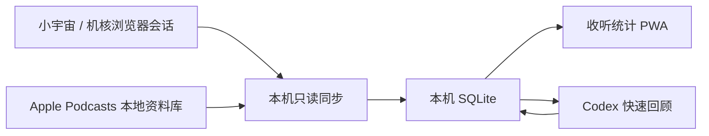

# 回声 · Podcast Memory

一个 local-first 的播客收听分析与知识回顾原型。它把小宇宙、机核和 Apple Podcasts 的收听历史统一到本机 SQLite，区分平台统计时长与估算时长，并把单集整理成可搜索的文字知识库。

[](https://github.com/eudaemoniaYH/echo-podcast-memory/actions/workflows/check.yml)
[](https://nodejs.org/)
[](#授权)


> [!IMPORTANT]
> 这是个人研究原型，不是小宇宙、机核或 Apple 的官方产品。项目使用没有公开稳定性承诺的接口和 Apple Podcasts 本地数据库结构；仅处理你有权访问的个人数据，请勿把它作为生产服务部署或向他人提供托管服务。

## 核心能力

- **Listening Analytics**：统一收听时长、节目数、单集数、最近收听和月度节奏，并明确区分准确值与估算值。
- **Knowledge Memory**：把简介、show notes 和时间轴整理成可搜索的分类、摘要、要点、提纲、关键词与回看问题。



## 为什么做这个项目

播客收听记录通常散落在不同平台，平台给出的“总时长”口径也不一致。回声尝试把记录层和知识层放进一个本地优先的工作流：先诚实标注哪些数据准确、哪些只是估算，再把可获得的文字资料整理成以后能够搜索和回看的个人记忆。

## 当前完成

- 小宇宙只读连接器：收听历史、播放进度、月度播放秒数，以及分页后的终身总里程
- 机核只读连接器：跨端可见历史、节目正文、时间轴、单集元数据和最后进度；以最近 200 期可见进度估算历史覆盖时长
- Apple Podcasts 只读连接器：自动读取由 iPhone 同步到 Mac 的单集、当前进度、已播放状态、最近播放时间和 show notes
- macOS 钥匙串只保存小宇宙与机核会话令牌；Apple 连接器不读取账号凭据
- 本机 SQLite、10 分钟增量同步、启动立即同步与手动立即同步
- macOS 登录后后台常驻，运行副本与资料安装在 `~/Library/Application Support/Podcast Memory`
- 可安装到 iPhone 主屏幕的 PWA；回到前台立即刷新，打开期间每分钟检查一次
- 按平台真实播放时间排列最近收听；主题分类、准确/估算时长分开展示
- 可搜索的“文字回顾”资料库，支持单集详情、平台/主题筛选和只看已有回顾
- 自动快速回顾：小宇宙或 Apple 标记听完，或机核播放达到 98%/距结尾 60 秒后，依据节目简介、show notes 和时间轴生成分类、摘要、要点、提纲、关键词与回看问题
- 快速回顾使用 Mac 已登录的 Codex 与 ChatGPT 订阅额度，不要求 OpenAI Platform API Key
- 首次启用以部署时间为基线，不会自动总结过去两千多期历史；任务持久化、单并发且重复同步不会重复生成
- 深度音频转写不会自动触发，并且默认关闭，避免产生 Platform API 费用
- Chrome/Chromium 本地连接器，一次绑定后不需要逐集导入

## 运行

需要 Node.js 22.13 或更新版本。

```bash
cd echo-podcast-memory
npm start
```

浏览器打开 <http://127.0.0.1:8787>。首次启动会显示清楚标记的演示数据。

要安全展示界面而不启用账号绑定、自动同步或 AI 检查，可用全新的临时数据目录启动只读展示模式：

```bash
PODCAST_MEMORY_DATA="$(mktemp -d)" PODCAST_MEMORY_SHOWCASE=1 npm start
```

日常使用建议安装为 macOS 后台服务：

```bash
./scripts/install-macos-agent.sh
```

安装后不需要保持终端窗口开启。完整的 iPhone 私有访问与“添加到主屏幕”步骤见 [docs/iphone-setup.md](docs/iphone-setup.md)。

> 展示模式只用于本机评审和截图，不应直接部署到互联网。项目没有提供公开托管真实收听资料的安全边界。

## 一次性绑定账号

1. Chrome 打开 `chrome://extensions`，启用“开发者模式”。
2. 点击“加载已解压的扩展程序”，选择本项目的 `extension` 文件夹。
3. 分别在小宇宙播客后台和机核网页完成正常登录：
   - <https://podcaster.xiaoyuzhoufm.com/>
   - <https://www.gcores.com/>
4. 打开连接器，输入仪表盘显示的 12 位短时配对码，并分别点击小宇宙、机核的“连接”。配对码 10 分钟后过期，连接成功后也会立即轮换。

连接器只读取平台已经写入浏览器的登录会话，并发送到 `127.0.0.1:8787`。项目用公开密钥固定连接器 ID，服务端只接受这个精确扩展来源和正确的短时配对码。若你自行更换扩展公钥，可以用 `PODCAST_MEMORY_EXTENSION_ORIGIN` 明确覆盖允许的来源。

Apple Podcasts 不使用 Chrome 连接器，也不需要手动导入：

1. iPhone：`设置 → App → 播客 → 同步资料库`。
2. Mac：首次打开系统“播客”App，完成欢迎/隐私确认，并确认登录的是同一个 Apple Account。
3. Mac“播客”：`播客 → 设置 → 通用 → 同步资料库`。
4. 第一次读取时，macOS 可能显示 `“node”想访问其他 App 的数据`；点击“允许”，让回声只读访问“播客”的本地资料库。
5. 等 Mac 中出现 iPhone 的播放位置后，回声会在下一轮 10 分钟同步中自动读取；也可以在 Apple Podcasts 卡片点“检查”。

若没有看到权限弹窗而 Apple 卡片持续显示“读取超过 5 秒”，再次点“检查”并查看其他窗口后方。读取在独立子进程中执行并有 5 秒硬超时，因此即使系统仍在等待授权，也不会卡住回声网页或另外两个平台的同步。

## 数据口径

| 来源 | 展示口径 | 准确性边界 |
| --- | --- | --- |
| 小宇宙 | 分页 `mileage` 终身累计；`monthly-wrapped` 仅用于月度图表 | 平台统计值；终身与月度不会重复相加 |
| 机核 | 最近 200 期可见进度 | 估算值；快进、回退、离线播放和历史保留范围都会造成偏差 |
| Apple Podcasts | 已完成单集时长加未完成单集当前进度 | 估算值；Apple 跨设备同步不是逐秒收听历史 API |

## 自动生成文字回顾

1. 在 Mac 上打开 ChatGPT/Codex，并确认 `codex login status` 显示 `Logged in using ChatGPT`。
2. 正常收听播客。小宇宙以平台的 `isFinished` 为准；机核以 98% 或距结尾 60 秒为完成阈值；Apple 以同步到 Mac 的 `hasBeenPlayed` 和播放位置为准。
3. 回声下一次同步识别到新的完成事件后，会把快速回顾放入本机持久队列并串行生成。
4. 生成结果保存在本机 SQLite，之后可按标题、播客名、简介或摘要搜索；单集详情仍保留手动重新生成按钮。

快速回顾只代表平台提供的文字资料，不会冒充完整音频内容。生成时，节目简介和时间轴会发送给 OpenAI；调用由已登录的 Codex 使用 ChatGPT 订阅额度完成，不会使用按量计费的 Platform API。Mac 需要开机、联网并保持 ChatGPT/Codex 登录。

自动队列从各平台首次启用时间开始记录，不回填旧的完成历史。Apple 第一次成功验证本地资料库时就建立完成状态基线，即使资料库当时为空，也不会吞掉之后听完的第一集；已有历史不会突然批量生成回顾。Apple 只以明确的“已播放”状态触发，并排除单纯手动“标为已播放”的情况。小宇宙听完后进度可能归零，因此完成判定独立使用平台的 `isFinished` 标志。自动任务一次只运行一个；失败后不会每 10 分钟无限重试，可在单集页面手动重试。

## 安全边界

- 小宇宙和机核请求均为 GET 或只读 POST；代码不会调用机核的 `history/playlist/add` 等写接口。
- Apple 连接器以隔离子进程和 SQLite read-only 模式读取系统“播客”的本地资料库，不修改 Apple 数据；首次读取需要用户允许 macOS 的“访问其他 App 数据”提示。它依赖 Apple 的私有本地 schema，系统升级后会先检查关键表与字段，不兼容或系统读取超时时只停止该平台同步，不会拖住主服务。
- 会话令牌位于 macOS Keychain，service 名为 `com.podcast-memory.xiaoyuzhou` 和 `com.podcast-memory.gcores`。
- Codex 子进程使用临时空目录、无网页搜索、无 MCP、无命令审批和最小文件读取权限；只传递运行所需的环境变量白名单，不继承 API Key、访问令牌或其他云凭据，确保快速回顾走 ChatGPT 登录。
- 自动快速回顾只发送完成单集的简介与时间轴，不上传整期音频。可选的深度转写代码默认关闭。
- 生成结果、平台令牌和收听数据库留在 Mac；自动任务会消耗 ChatGPT 计划内的 Codex 使用额度。
- `.data/`、SQLite、配对码、环境文件、日志和构建产物均被 Git 排除；仓库只包含合成演示数据。
- 这是个人技术原型，尚未取得平台集成或品牌素材授权。平台接口没有公开稳定性承诺，可能随时变化或被阻断。

## 仓库与授权说明

- 平台名称仅用于说明兼容的数据来源；界面不分发平台官方图标，不代表认可、合作或隶属关系。
- 本仓库用于公开展示与技术交流，但目前没有授予复制、修改、再分发或商业使用代码的许可。详情见[授权](#授权)。

## 安全与贡献

- 安全问题请不要公开提交包含 Cookie、配对码、收听记录或其他个人数据的 Issue；处理方式见 [SECURITY.md](SECURITY.md)。
- 功能建议和不含敏感数据的缺陷报告欢迎通过 Issue 提交；贡献边界见 [CONTRIBUTING.md](CONTRIBUTING.md)。

## 授权

Copyright © 2026 eudaemoniaYH. All rights reserved.

除非权利人另行书面授权，本仓库未授予复制、修改、分发、再许可或商业使用的权利。公开可见和可被 Star 不等同于开源许可。平台名称及相关权利归各自权利人所有。

## 验证

```bash
npm run check
```
